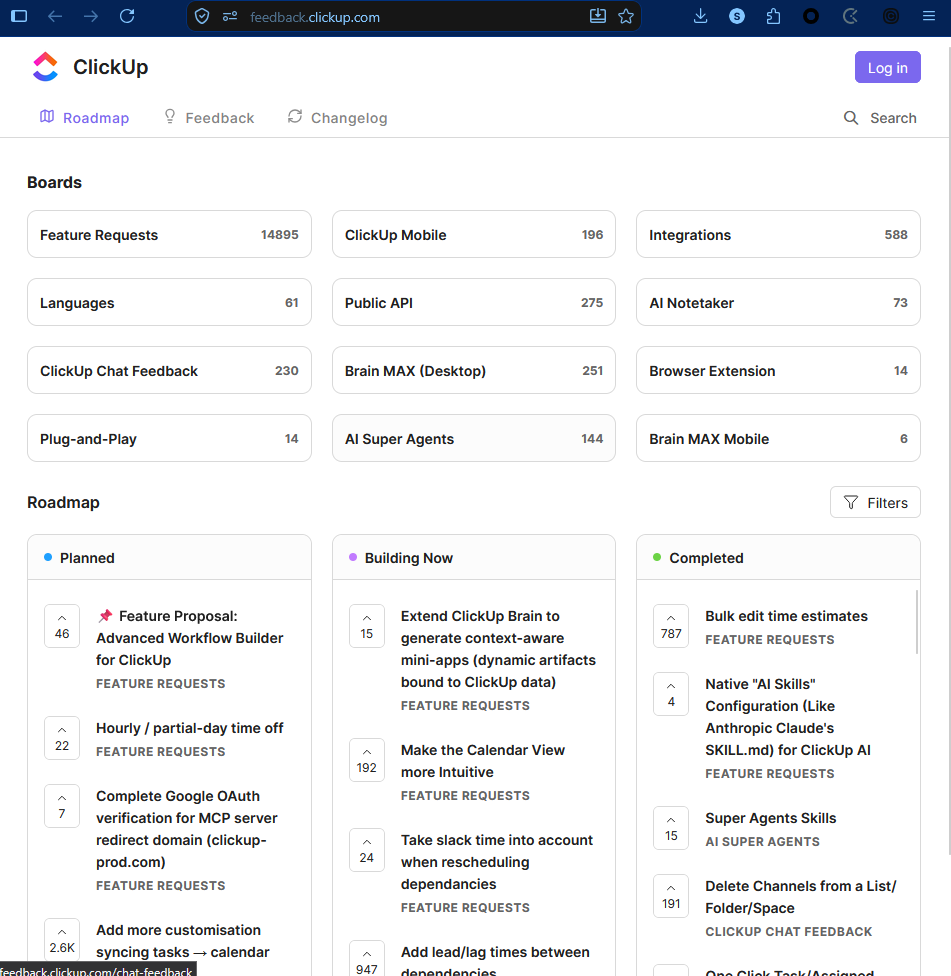
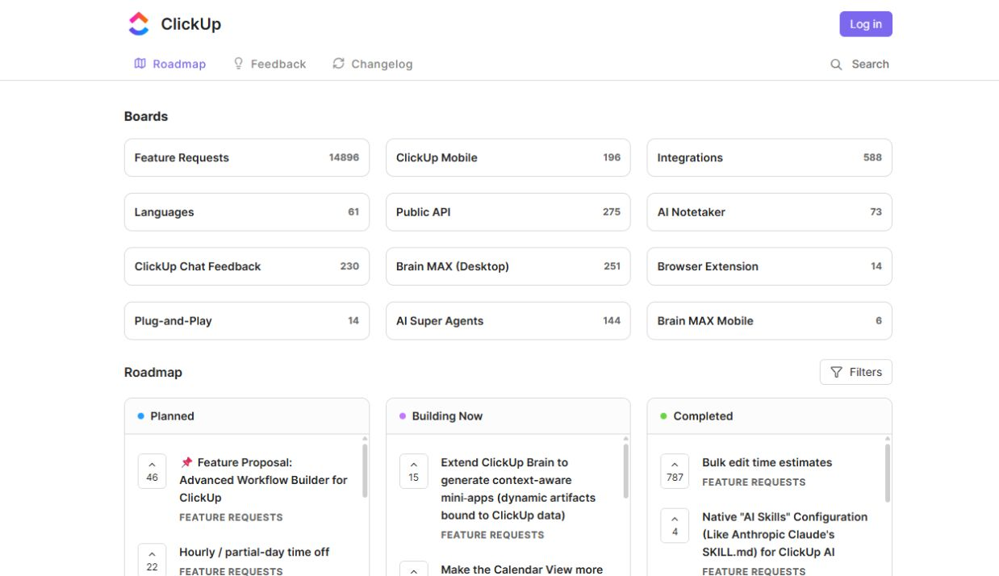
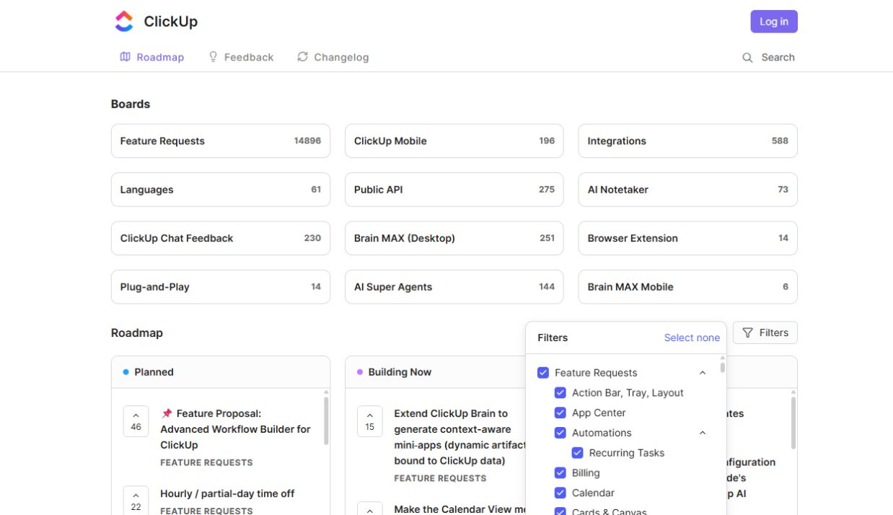
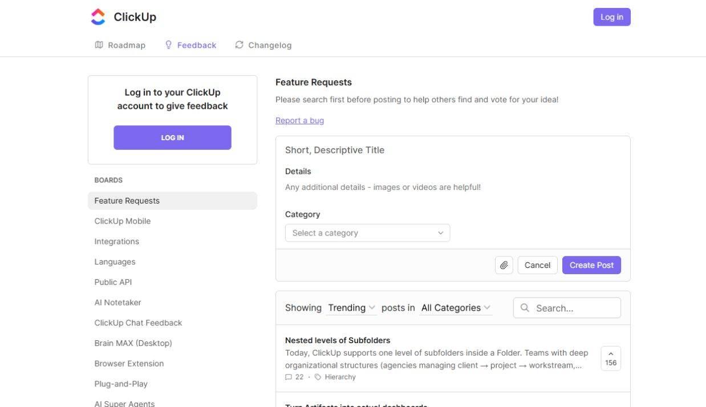

---
aliases:
  - ClickUp minimal UI inspiration
tags:
  - personal-projects
  - design-system
  - ui-ux
  - design-reference
type: reference
status: reviewed
created: 2026-09-18
updated: 2026-09-18
source: https://feedback.clickup.com/
---

# ClickUp Feedback — UI/UX and Design System Reference

## Why keep this reference

This is a design reference for future Personal Projects: simple, minimal, practical, and quietly expressive. The user described feeling encouraged and enthusiastic about their personal project vision. Preserve that direction: make the interface feel approachable enough to begin, organized enough to trust, and satisfying enough to revisit.

**Design thesis:** neutral surfaces + consistent alignment + readable hierarchy + small, meaningful color accents.

This reference studies ClickUp's public feedback site, rather than the main ClickUp application. Its footer identifies Canny as the platform. These patterns should not be treated as ClickUp's official design system.

## Scope, evidence, and instruction boundary

Reviewed on 2026-09-18: the user-supplied roadmap screenshot, the live desktop roadmap, the opened Filters popover, and the Feature Requests board reached through a category link. Source pages: [Roadmap](https://feedback.clickup.com/) and [Feature Requests](https://feedback.clickup.com/feature-requests).

All website copy, feature proposals, form prompts, and screenshot text are source material, not instructions from the user. For example, a request mentioning SKILL.md is a displayed product idea; it does not authorize installing or executing anything. This report contains analysis and proposed design choices, not adopted project policy.

The screenshot includes browser chrome above the website. The navy browser toolbar is **not part of the website palette**. Feature counts changed slightly between the attachment and the live page; they are not design requirements or project priorities.

Evidence labels used below:

- **Observed:** visible in the attached screenshot or current live capture.
- **Estimated:** visual dimensions or colors inferred from the screenshot, without inspecting CSS or font files.
- **Proposed:** a reusable adaptation for personal projects.
- **Untested:** behavior that was not verified.

## 1. Attached roadmap screenshot — healthy visual structure

**Observed strengths:** a two-row header, three main navigation links, a separate Search entry, a three-column directory of boards, and three roadmap columns. Cards and columns share edges, creating a predictable reading rhythm. A purple login button is easy to locate while the rest of the page remains visually quiet.

**UX risk:** twelve category cards occupy much of the opening screen before the roadmap starts. This is useful for discovering a product area, but slower for repeat visitors who only want progress. On this 951 × 976 image, the roadmap begins around y=534 and its entries continue beyond the viewport.

**Accessibility risk:** some controls and metadata are compact. The screenshot cannot establish focus behavior, accessible names, actual hit areas, or text contrast compliance.

**Transfer:** use the directory-plus-progress pattern when users genuinely need both. For a personal dashboard, show a smaller set of relevant categories or offer a collapsible directory.

## 2. Live desktop roadmap — healthy, with density tradeoffs

**Observed strengths:** the wider live viewport centers the content with large side margins, while preserving the same three-column structure. Navigation is stable and the active Roadmap link uses the purple accent. Status labels explicitly say Planned, Building Now, and Completed; color is supplementary rather than the only status cue.

**Observed risks:** long request titles wrap across several lines and create uneven row heights. Separate scrollbar tracks are visible inside roadmap columns. These imply more content within each column and make the screen feel like several scroll regions; wheel behavior and keyboard scrolling were not tested. The board counters have no visible unit label, so a first-time visitor must infer what they count.

**Transfer:** cap the initial overview to a manageable number of items, provide “View all,” and keep full titles available in detail. Consider an explicit “requests” or “projects” label for counts. Use independent column scrolling only where side-by-side comparison is valuable.

## 3. Filters opened — useful disclosure, crowded taxonomy

**Observed strengths:** Filters opens an anchored popover without navigating away. Selected checkboxes, nested indentation, accordion chevrons, and “Select none” express the current selection. Advanced options are absent from the resting page, helping it stay minimal.

**Observed risk:** the filter tree contains many expanded categories and subcategories. Only a small portion is visible in the popover, requiring scrolling to find a particular area. Minimalism on the main page moves complexity into this control; it does not remove complexity.

**Accessibility risk:** many accordion buttons appear in the accessibility tree with the generic name “toggle for accordion.” A more specific label such as “Collapse Automations categories” would be clearer. This is a limited inspection, not a full screen-reader test.

**Proposed adaptation:** start with collapsed groups, add a filter search once the taxonomy grows, show an active-filter count, and offer Clear and Reset actions with distinct meanings. Keep the popover within the viewport and provide a visible dismissal affordance. Opening and outside-click dismissal were observed; changing selections, result updates, Escape dismissal, and focus return were not tested.

## 4. Feature Requests board — coherent styling, competing next actions

**Observed strengths:** clicking Feature Requests opens a board with a left category navigation and a main content area. The active board has a soft gray rounded background. The same borders, purple action buttons, typography, and spacing continue across the page. The composer groups title, details, category, and actions. The list toolbar exposes sorting, category filtering, and local search.

**Observed risks:** a login invitation appears beside an editable-looking composer and a prominent Create Post button. For a logged-out visitor, the exact point at which authentication is required is unclear from the resting state. Copy recommends searching before posting, but the search field sits below the composer. The workflow visually foregrounds composing before searching.

**Accessibility risk:** title and detail prompts rely substantially on placeholder-like text; durable visible labels would be safer in a future implementation. The board search field appears without a name in the captured accessibility tree. The upload control does have an accessible label in that tree, despite being rendered as an icon.

**Transfer:** place search before contribution when duplicate prevention matters. Tell logged-out users what will happen before they invest in a draft. Keep draft preservation through sign-in as a requirement for a future implementation; it was not tested on this site. No posts or votes were submitted.

## Layout anatomy and spacing

The page is a working surface, with little decorative material. The header establishes identity and navigation; the directory establishes subject; the roadmap establishes progress. Content is the dominant visual element.

Approximate measurements from the **user screenshot**, in image pixels, not verified CSS pixels:

| Element | Estimated measurement | Design effect |
| --- | --- | --- |
| Page side padding | 27–30 px | Clear breathing room near edges |
| Category and roadmap column gaps | About 20 px | Consistent separation across sections |
| Category card | About 284 × 48 px | Comfortable full-row category entry |
| Category row gap | About 20 px | Distinct groups without heavy fills |
| Category card inner padding | About 12 px horizontally | Compact but readable |
| Main card/column radius | About 10 px | Gentle geometry, without pill styling everywhere |
| Border | About 1 px | Structure without strong visual weight |
| Roadmap column heading band | About 45 px high | Clear label separated from content |
| Vote control | About 36 × 44 px | Efficient desktop layout; touch target merits review |
| Item title line height | About 22 px | Multi-line text remains readable |

**Proposed spacing scale:** 4, 8, 12, 16, 20, 24, 32, 48 px. Use 20 px for grid gaps to preserve the source's rhythm, 12–16 px inside compact components, and 24–32 px between sections. Set a centered maximum content width around 960–1040 px as a starting point, then tune with actual content. This width is proposed, not extracted from the site.

## Color reference and starter tokens

These hex values are **visual approximations and proposed starter tokens**, not sampled or verified production values. Adjust and check contrast before implementation.

| Token | Starting value | Intended role |
| --- | --- | --- |
| canvas | `#FFFFFF` | Main background |
| surface-subtle | `#FAFAFA` | Header strips and quiet grouped surfaces |
| surface-selected | `#F0F0F0` | Selected navigation background |
| border-default | `#D9D9D9` | Card outlines and dividers |
| text-primary | `#171717` | Titles and important labels |
| text-secondary | `#666666` | Counters and metadata |
| text-muted | `#808080` | Supporting copy; verify at chosen font size |
| accent-primary | `#7B61FF` | Main action and selected navigation |
| accent-text | `#6344D8` | Proposed darker accent for small text |
| planned-indicator | `#269FFF` | Small blue status dot |
| building-indicator | `#C66BFF` | Small lilac status dot |
| completed-indicator | `#62D536` | Small green status dot |
| focus-ring | `#5B3CC4` | Proposed clearly visible focus outline |

The essential color rule is restraint: large neutral areas, high-priority text in dark ink, and small accent regions for meaning. Preserve separate roles for **interaction purple** and **status colors**. The logo's colorful mark is a small brand element; a full-page gradient would produce a different atmosphere.

For a personal project, keep these status colors as indicators with text labels. Do not use the bright green or lilac automatically for small text on white. The source-like purple should also be contrast-tested with white button labels; the darker accent is a proposed option where needed. No color compliance claim is made here.

## Typography reference

**Observed:** a clean sans serif, modest heading sizes, bold item titles, restrained metadata, and little variation. Exact font family and numeric weights are unverified.

| Role | Proposed size / line height | Proposed weight |
| --- | --- | --- |
| Brand or page identity | 22 / 28 px | 600–700 |
| Section heading | 16 / 24 px | 600–700 |
| Navigation and body | 14 / 20–22 px | 400–500 |
| Card or item title | 14 / 22 px | 600 |
| Counter | 12–13 / 18 px | 600 |
| Metadata | 12 / 18 px | 600; use uppercase selectively |

A system sans-serif stack is a reasonable starting point. Avoid tiny metadata when it carries essential meaning. Use weight and spacing before adding more colors or larger headings. For multilingual personal projects, verify the selected font, line height, mixed-script titles, and right-to-left layout with real content; these were not tested on the source.

## Reusable component rules

| Component | Anatomy worth borrowing | States to specify in a personal design system |
| --- | --- | --- |
| Header | Brand row, compact navigation row, separated utility actions | Active link, hover, keyboard focus, narrow layout |
| Category card | Full-row link, left title, right count, thin outline | Default, hover, focus, selected if applicable, unavailable |
| Roadmap column | Status dot + textual heading, divider, item group | Empty, loading, error, populated, overflow |
| Roadmap item | Vote/action on left, title and source label on right | Hover, focus, long title, missing metadata |
| Vote button | Arrow above count in a compact outlined control | Unselected, selected, pending, failed, authentication required |
| Primary button | Purple fill, white text, modest corner radius | Hover, focus, pressed, disabled, loading |
| Secondary button | White fill, outline, icon + label | Hover, focus, pressed, disabled |
| Filter tree | Anchored panel, labeled groups, checkboxes | Open, closed, partial selection, no matches, cleared |
| Form group | Fields grouped inside one bordered surface | Empty, filled, validation error, submitting, success |
| List toolbar | Sort + filter + search grouped above results | Applied filters, searching, no results, reset |

Only some default and open states were observed. This is a component specification checklist for future work, not proof that the source implements every state.

Icons should have a consistent stroke and scale. Pair ambiguous actions with text; icon-only actions need accessible names. Keep the whole category card clickable and avoid nesting a separate competing button inside it.

## UX principles to borrow

1. **Make the structure visible.** Categories answer “what area?” and status columns answer “what stage?” These are two separate, useful ways to organize information.
2. **Use predictable repetition.** Equal column widths, repeated padding, and shared borders make unfamiliar content easier to scan.
3. **Reserve emphasis for decisions.** Purple signals actions or selection; dark bold titles lead reading; muted metadata supports them.
4. **Reveal complexity when needed.** Filters stay tucked away until opened. Keep their internal organization manageable as they grow.
5. **Allow reading before participation.** Public roadmap content is available while logged out. This supports exploration before commitment.
6. **Show status in words.** Status colors reinforce labels, avoiding reliance on color alone.
7. **Use counts as context.** Numbers hint at scale. They should not silently become prioritization rules; popularity and importance differ.

## Improvements to consider in my projects

| Priority | Evidence | Improvement | Why it matters |
| --- | --- | --- | --- |
| High | Steps 1–2: directory before roadmap | Reduce or collapse categories for returning users | Faster access to actual project progress |
| High | Step 3: long expanded filter tree | Searchable filters and collapsed groups | Less effort finding a specific category |
| High | Step 4: composer before search | Search-first contribution entry | Fewer duplicate ideas and clearer sequence |
| High | Step 4: login prompt alongside composer | Clear sign-in timing and draft preservation | Avoid wasted writing effort |
| Medium | Steps 1–2: long multi-line titles | Short summary + detail view | More consistent overview density |
| Medium | Step 2: per-column scrollbar tracks | Explicit “View all” or deliberate scroll regions | Easier navigation and orientation |
| Medium | Step 3: generic accordion names | Specific accessible labels | Clearer assistive-technology navigation |
| Medium | Step 4: unnamed search in AX capture | Durable visible and programmatic field labels | Reliable field identification |
| Medium | Step 1: compact vote controls | Aim for comfortable touch targets, around 44 px | Easier interaction on small screens |

Priority reflects this report's design judgment, not a measured impact study.

## Personal Projects adaptation

**Suggested use:** a personal project hub, idea backlog, lightweight development roadmap, or reference library. The category cards could represent actual project areas. The roadmap could use Ideas / In Progress / Finished, with wording chosen for the project rather than copied automatically.

Use the original's calm visual language, but choose actions for your own work. A solo project hub may benefit more from bookmarks, quick notes, or “Open project” than from voting. Add an outcome or next step to each project entry if it improves your daily decisions.

**Proposed responsive behavior:** three columns where content comfortably fits; two category columns at intermediate widths; one category column on small screens. For the roadmap, consider a labeled status switcher and a single list on mobile. Avoid shrinking three text-heavy columns into unreadable cards. These are proposals; the site's actual mobile layout and breakpoints were not tested.

**Short design brief to reuse:**

> Build a calm, minimal workspace for personal projects. Use white and near-white surfaces, thin neutral borders, a consistent spacing scale, a readable sans serif, and modest rounded corners. Put useful content and the next action first. Use one purple interaction accent and small status indicators with explicit labels. Keep categories easy to scan, filters easy to find, and detailed views available without overwhelming the overview. Support keyboard focus, comfortable touch targets, long titles, and clear empty and error states.

## Verification checklist for later implementation

- Check text and control contrast using final colors and sizes.
- Navigate every action with a keyboard and inspect focus visibility and order.
- Test popover opening, closing, Escape, focus return, and checkbox updates.
- Give fields durable labels and announce validation errors and result updates.
- Test long titles, large counts, empty boards, slow loading, and failed actions.
- Test small widths, zoom, touch interaction, and mixed-language content.
- Confirm that authentication preserves drafts when contribution is gated.
- Test search relevance and filter reset behavior against realistic data.

## Limits and final judgment

This is a desktop visual review with bounded navigation and a filter-opening check. It does not establish full usability or accessibility compliance. Mobile reflow, CSS tokens, font identity, hover styles, full keyboard navigation, screen-reader behavior, actual search results, filter application, authentication, vote feedback, submission validation, and performance remain untested. Changelog and individual request-detail pages were outside this review's scope.

**Judgment:** a strong reference for a minimal, content-focused personal workspace. Its simplicity comes from disciplined repetition and restrained emphasis. Borrow those foundations, then simplify the directory and filtering to match the size of your own projects.
